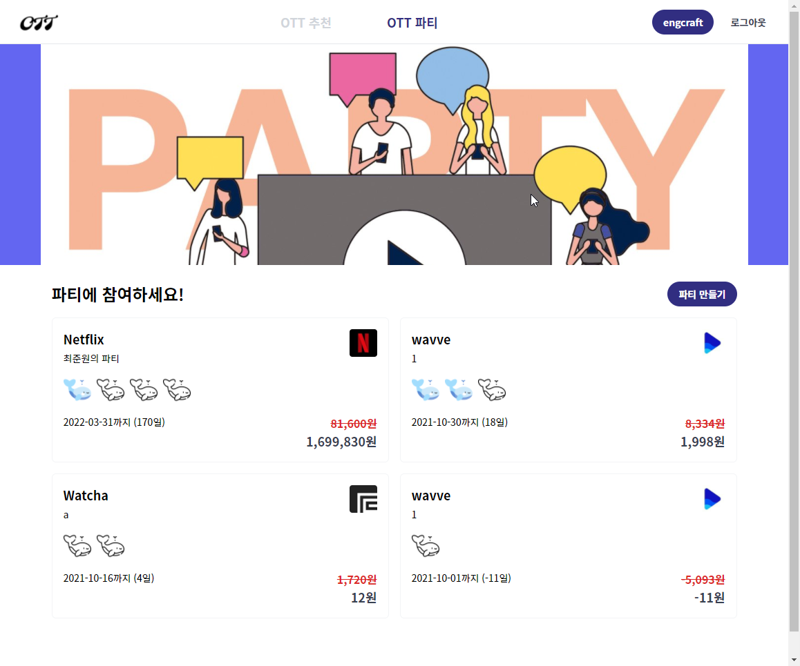
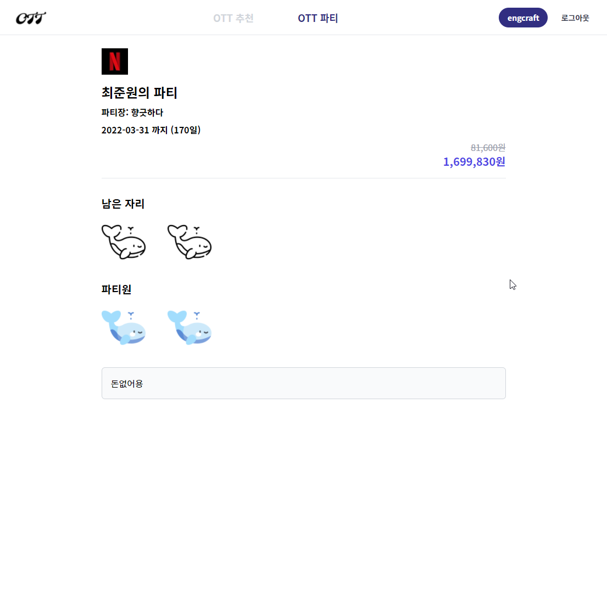
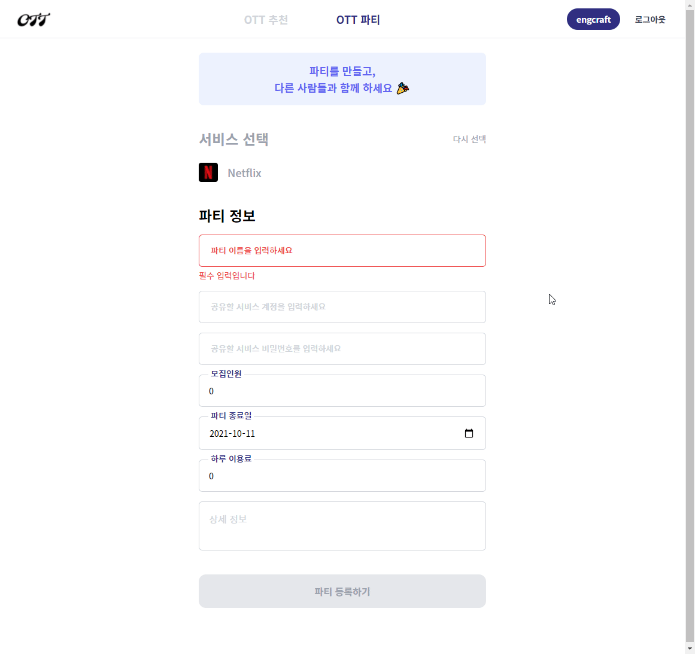
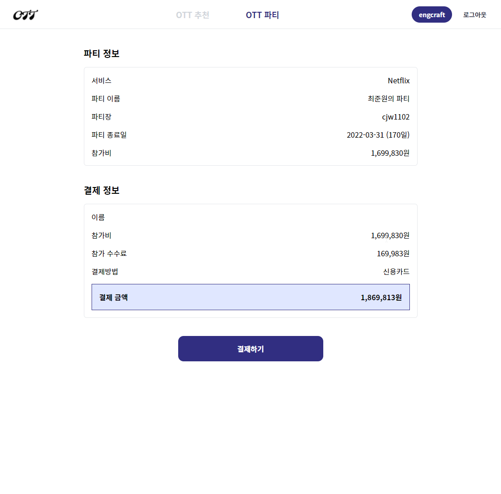
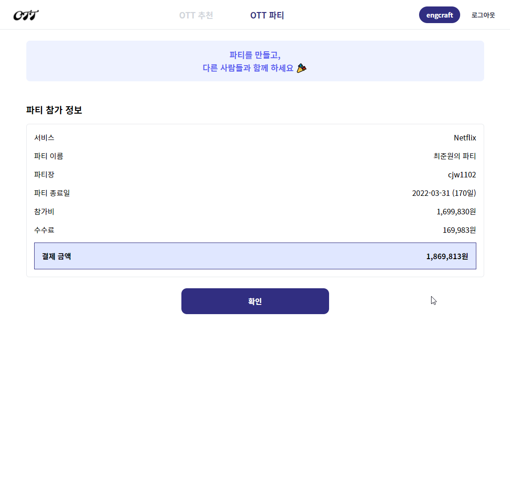
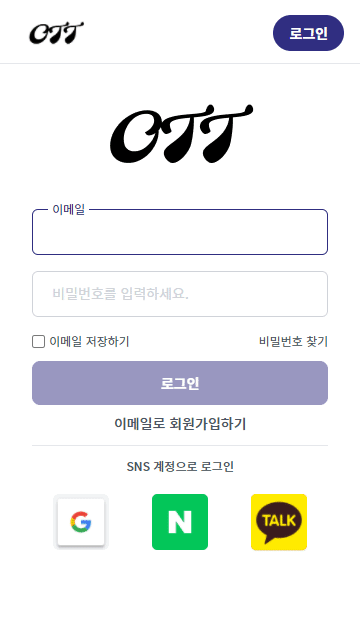
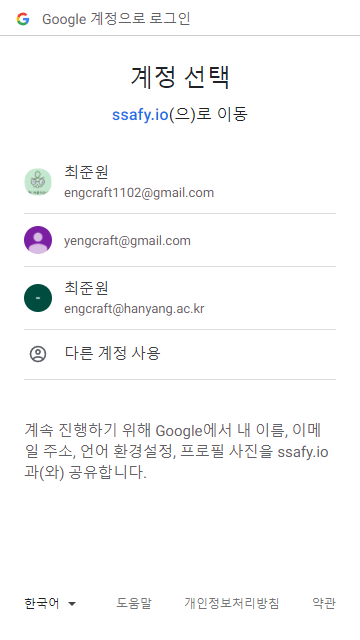
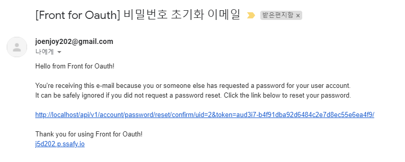
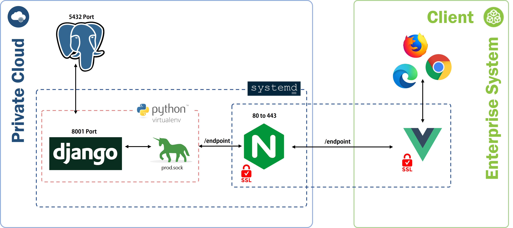

## 👨‍👨‍👦‍👦 Member

| Name     | 김병훈                                          | 최준원                                        | 최정훈                                        | 한주연                                        | 이승균                                          |
| -------- | ----------------------------------------------- | --------------------------------------------- | --------------------------------------------- | --------------------------------------------- | ----------------------------------------------- |
| Profile  |  |  |  |  |  |
| Position | FE & UI/UX                                      | FE & CI/CD                                    | BE & CI/CD                                    | BE & Data                                     | FE                                              |
| Git      | [@byung-hun](https://github.com/byunghun-jake)  | [@gomyo](https://github.com/gomyo)            | [@maru9525](https://github.com/maru9525)      | [@taxol1203](https://github.com/taxol1203)    |                                                 |

## 🤩 Service

### OTT 추천

#### Main

#### Detail

### OTT Party

#### Main

#### Detail

#### Create

#### Pay

#### Pay confirm

### Auth

#### Login

#### google login

#### Password Reset mail

## 😎 배포 플로우

## ✨ 기술 스택

### Back-End

    
기술스택 & 라이브러리

    <h4>기술스택 ⚙</h4>
    <ul>
        <li>python @3.6.8</li>
        <li>Django @3.2.7</li>
        <li>postgreSql @12</li>
    </ul>
    <h4>라이브러리 📚</h4>
    <ul>
        <li>dj-rest-auth</li>
        <li>pickle</li>
        <li>Simple JWT</li>
        <li>allauth</li>
        <li>django-rest-swagger</li>
        <li>sklearn</li>
        <li>numpy</li>
        <li>pandas</li>
    </ul>

### Front-End

    
기술스택 & 라이브러리

    <h4>기술스택 ⚙</h4>
    <ul>
        <li>HTML</li>
        <li>CSS, SCSS</li>
        <li>JavaScript</li>
        <li>TypeScript @4.1.5</li>
        <li>Vue.js @3.0.0</li>
    </ul>
    <h4>라이브러리 📚</h4>
    <ul>
        <li>axios @0.21.4: Promise 기반 HTTP 클라이언트</li>
        <li>eslint @6.7.2: formatter 라이브러리</li>
        <li>prettier @2.2.1: formatter 라이브러리</li>
        <li>tailwindCSS npm:@tailwindcss/postcss7-compat@^2.2.14: CSS 스타일링 라이브러리</li>
        <li>sass-loader @8.0.2: SCSS 적용을 위한 라이브러리</li>
    </ul>

## 📜 Project Docs

#### [Notion 📚](https://www.notion.so/binitiger/SSAFY_-_D202-7215f9f32efa4451a137842f6e5514c5)

