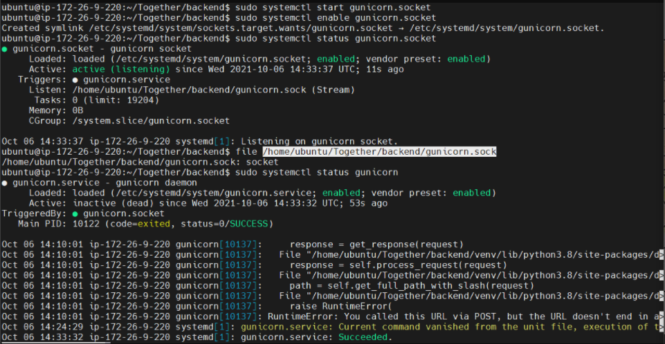

# Together 배포 가이드 문서

### 1. 환경
| 이름        | 구성        | 버전                                               | 비고 |
| ----------- | ----------- | -------------------------------------------------- | ---- |
| main server | EC2         | Ubuntu 20.04 LTS (GNU/Linux 5.4.0-1018-aws x86_64) |      |
| frontend    | Vue.js      | vue @3.0.0<br />TypeScript @4.1.5 |      |
| backend     | Django | python @3.8.2<br />Django @3.2.7<br />Postgres @12 |      |

### 2. 서버, DB 세팅

django는 migrate할 경우 DB의 세팅이 필수적이기 때문에 함께 진행합니다.

- 파이썬 가상환경 설치
  `sudo apt-get install python3-venv`

- postgres 설치
```
sudo sh -c 'echo "deb http://apt.postgresql.org/pub/repos/apt $(lsb_release -cs)-pgdg main" > /etc/apt/sources.list.d/pgdg.list'
wget --quiet -O - https://www.postgresql.org/media/keys/ACCC4CF8.asc | sudo apt-key add -
sudo apt-get update
sudo apt-get -y install postgresql
```

- postgres 세팅 변경
  `sudo vim /etc/postgresql/14/main/postgresql.conf`

```bash
#------------------------------------------------------------------------------
# CONNECTIONS AND AUTHENTICATION
#------------------------------------------------------------------------------

# - Connection Settings -

listen_addresses = '*'         # what IP address(es) to listen on;
                                        # comma-separated list of addresses;
                                        # defaults to 'localhost'; use '*' for all
                                     # (change requires restart)
port = 5433                             # (change requires restart)
max_connections = 100                   # (change requires restart)
#superuser_reserved_connections = 3     # (change requires restart)
unix_socket_directories = '/var/run/postgresql' # comma-separated list of directories
                                        # (change requires restart)
#unix_socket_group = ''                 # (change requires restart)
#unix_socket_permissions = 0777         # begin with 0 to use octal notation
                                        # (change requires restart)
#bonjour = off                          # advertise server via Bonjour
                                        # (change requires restart)
#bonjour_name = ''                      # defaults to the computer name
                                        # (change requires restart)
```

수동배포를 위한 postgres 포트는 5433으로 연다.  listen_addresses가 주석처리되어있던 것을 수정했다.

- `sudo vim /etc/postgresql/14/main/pg_hba.conf` 아래와 같이 수정
  md5 옵션을 넣어서 항상 비밀번호를 넣어서 실행시키도록 변경

```bash
# DO NOT DISABLE!
# If you change this first entry you will need to make sure that the
# database superuser can access the database using some other method.
# Noninteractive access to all databases is required during automatic
# maintenance (custom daily cronjobs, replication, and similar tasks).
#
# Database administrative login by Unix domain socket
local   all             postgres                                peer

# TYPE  DATABASE        USER            ADDRESS                 METHOD

# "local" is for Unix domain socket connections only
local   all             all                                     peer
# IPv4 local connections:
host    all             all             0.0.0.0/0               md5
# IPv6 local connections:
host    all             all             ::1/128                 md5
# Allow replication connections from localhost, by a user with the
# replication privilege.
# local   replication     all                                     peer
# host    replication     all             127.0.0.1/32            scram-sha-256
# host    replication     all             ::1/128                 scram-sha-256
```

- Postgres 관련 설정 후 재시작
  `sudo /etc/init.d/postgresql restart`

- 이후 Python 가상환경을 실행한 뒤, 아래의 명령을 먼저 실행

```bash
# postgres 관련 패키지가 없으므로, 관련 패키지를 추가로 설치해 주어야 한다.
$ sudo apt-get install libpq-dev
$ sudo apt-get install python3-Psycopg2
$ sudo pip3 install Psycopg2
```

- postgres가 정상적으로 설치되었다면 django migrate를 실행한 후 데이터 dump

### 3.nginx, SSL 설치 및 설정

### **nginx 설치**

```
sudo apt-get install nginx
```

### **nginx 서버 블록 설정**

nginx 설정 파일 수정

```
sudo vi /etc/nginx/nginx.conf
```

`http {}` 블록 안에 아래의 구문 추가

```
include /etc/nginx/sites-enabled/*.conf; // sites-enabled 디렉토리에서 서버 블록을 찾도록 지시
server_names_hash_bucket_size 64; // 도메인이름 분석하는데 할당되는 메모리 양
```

### **서버 블록 파일 만들기**

```
sudo vi /etc/nginx/sites-available/j5d202.p.ssafy.io.conf
server {
        server_name j5d202.p.ssafy.io www.j5d202.p.ssafy.io;

        root /home/ubuntu/dist;
        index index.html;
        location / {
                try_files $uri $uri/ /index.html;
        }

        location /account {
                proxy_pass <https://localhost:8080>;
                proxy_redirect off;
                charset utf-8;

                proxy_set_header   X-Real-IP $remote_addr;
                proxy_set_header   X-Forwarded-For $proxy_add_x_forwarded_for;
                proxy_set_header   X-Forwarded_proto $scheme;
                proxy_set_header   X-NginX-Proxy true;
        }
        location /accounts {
                proxy_pass <https://localhost:8080>;
                proxy_redirect off;
                charset utf-8;

                proxy_set_header   X-Real-IP $remote_addr;
                proxy_set_header   X-Forwarded-For $proxy_add_x_forwarded_for;
                proxy_set_header   X-Forwarded_proto $scheme;
                proxy_set_header   X-NginX-Proxy true;
        }
}
server {
        listen 80;
        listen [::]:80;

        server_name j5d202.p.ssafy.io www.j5d202.p.ssafy.io;
        return 301 https://$server_name$request_uri;

        index index.html index.htm;
}
```

### **서버 블록 파일 활성화**

이제 서버 블록 파일을 만들었으니 nginx가 방문자에게 파일을 제공할 수 있도록 활성화합니다.

이를 위해 `sites-enabled` 디렉토리에 각 서버 블록에 대한 심볼릭 링크를 생성합니다.

```
sudo ln -s /etc/nginx/sites-available/j5d202.p.ssafy.io.conf /etc/nginx/sites-enabled/j5d202.p.ssafy.io.conf
```

### **nginx 관련 명령어**

```
$ sudo apt install nginx
$ sudo systemctl start nginx
$ sudo systemctl stop nginx # nginx 서비스 중단
$ sudo systemctl reload nginx # nginx 설정 리로드
$ sudo nginx -t # nginx 설정 체크 (test)
```

## **SSL 설치 및 설정**

letsencrypt 설치

```
sudo apt-get install letsencrypt
```

nginx 중지 (도커로 띄워놓지 않은 상태입니다)

```
sudo systemctl stop nginx
```

인증서 발급

```
sudo letsencrypt certonly --standalone -d j5d202.p.ssafy.io
```

- 정상적으로 발급되었을 경우 /etc/letsencrypt/live/{도메인 네임}에 키 값을 얻을 수 있습니다.

SSL 옮기기

```
$ sudo cp /etc/letsencrypt/live/j5d202.p.ssafy.io/fullchain.pem <볼륨 매핑(컨테이너)에 사용될 폴더>
$ sudo cp /etc/letsencrypt/live/j5d202.p.ssafy.io/privkey.pem <볼륨 매핑에 사용될 폴더>
```

nginx conf 수정

```
server {
        listen 443 ssl;
        listen [::]:443 ssl;

        server_name j5d202.p.ssafy.io www.j5d202.p.ssafy.io;

        ssl_certificate <컨테이너에서 사용할 폴더 path>/fullchain.pem;
        ssl_certificate_key <컨테이너에서 사용할 폴더 path>/privkey.pem;

        root /home/ubuntu/dist;
        index index.html;

        location / {
                try_files $uri $uri/ /index.html;
        }

        location /account {
                proxy_pass <https://localhost:8080>;
                proxy_redirect off;
                charset utf-8;

                proxy_set_header   X-Real-IP $remote_addr;
                proxy_set_header   X-Forwarded-For $proxy_add_x_forwarded_for;
                proxy_set_header   X-Forwarded_proto $scheme;
                proxy_set_header   X-NginX-Proxy true;
        }
        location /accounts {
                proxy_pass <https://localhost:8080>;
                proxy_redirect off;
                charset utf-8;

                proxy_set_header   X-Real-IP $remote_addr;
                proxy_set_header   X-Forwarded-For $proxy_add_x_forwarded_for;
                proxy_set_header   X-Forwarded_proto $scheme;
                proxy_set_header   X-NginX-Proxy true;
        }
}
server {
        listen 80;
        listen [::]:80;

        server_name j5d202.p.ssafy.io www.j5d202.p.ssafy.io;
        return 301 https://$server_name$request_uri;

        index index.html index.htm;
}
```

nginx 시작

```
sudo systemctl start nginx
```

## 4. uWSGI 설정

장고와 웹 서버 소프트웨어가 통신하기 위한 WSGI(Web Server Gateway Interface)의 설치와 설정이 필요합니다.

- gunicorn 설정파일 생성

`sudo vi /etc/systemd/system/gunicorn.service`

```bash
[Unit]
Description=gunicorn daemon
After=network.target

[Service]
User=ubuntu
Group=www-data
WorkingDirectory=/home/ubuntu/Together/backend
ExecStart=/home/ubuntu/Together/backend/venv/bin/gunicorn \
        --workers 3 \
        --bind unix:/home/ubuntu/Together/backend/gunicorn.sock \
        --access-logfile access.log \
        --error-logfile error.log \
        {django_repo_name}.wsgi:application

[Install]
WantedBy=multi-user.target
```

gunicorn socket 방식으로 돌려 주었습니다.

위와 같이 설정해 주고 nginx와 gunicorn 모두를 재시작 해줍니다.

```bash
sudo systemctl stop gunicorn.socket
sudo systemctl stop gunicorn.service
sudo systemctl daemon-reload
sudo systemctl start gunicorn.socket
sudo systemctl start gunicorn.service
sudo service nginx restart

sudo systemctl status gunicorn.socket
sudo systemctl status gunicorn.service
```

결과가 아래와 같이 나오면 성공입니다.


