# 시연 시나리오

## 회원

### 회원가입

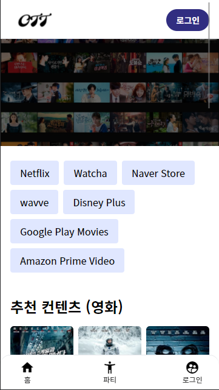

> 1. 사이트 접속
> 2. 우측 상단에 있는 로그인 버튼을 클릭한다.

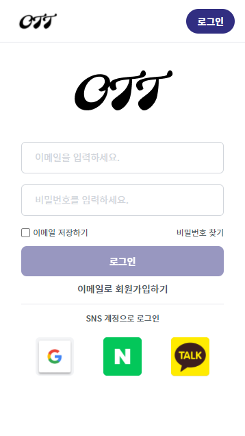

> 1. 로그인 버튼 아래에 있는 이메일로 회원가입하기 링크 클릭

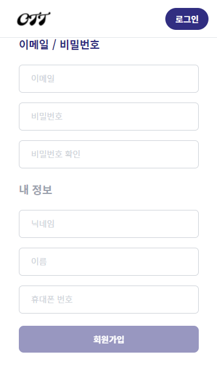

> 1. 이메일, 비밀번호, 비밀번호 확인을 입력
> 2. 닉네임, 이름, 휴대폰 번호를 입력
> 3. 필수 정보들을 입력한 뒤, 회원가입 버튼을 클릭하여 회원가입 과정을 마친다.
> 4. 회원가입과 동시에 로그인됩니다.

> 참고 정보
>
> 1. 각 input 별로 validator가 설정되어 있어, 입력 이벤트가 발생했을 때 유효성 검사를 실시한다.
> 2. DB에 중복된 이메일이 있는 경우 에러가 발생되어 사용자에게 알려줍니다.

## OTT 컨텐츠

### 영화 탐색

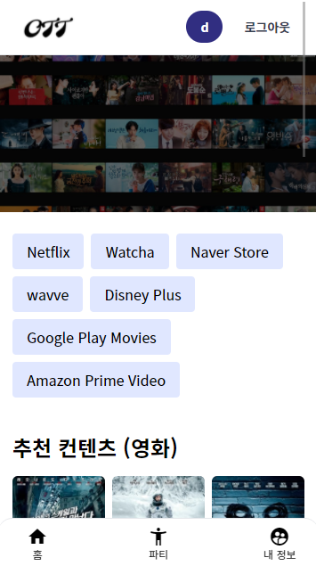

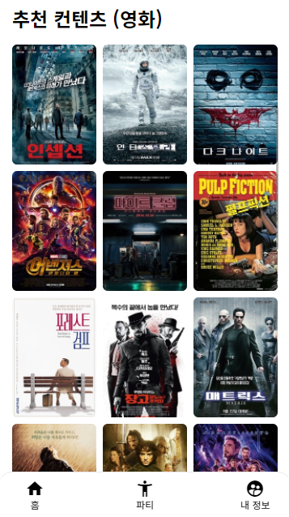

> 추천 컨텐츠는 영화와 드라마로 나누어져 있습니다.
>
> 상단에 있는 OTT 제공자 필터를 통해 컨텐츠를 필터링할 수 있습니다.
>
> 1. 목록에 있는 콘텐츠 중 하나를 선택합니다. (상세 페이지로 이동)

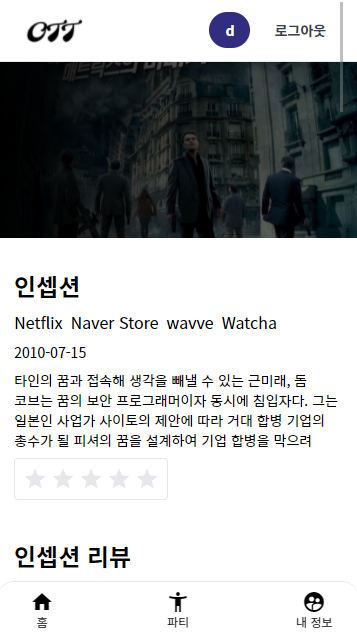

> 디테일 페이지는 영화 정보, 유튜브 리뷰, 관련 컨텐츠, 파티 목록, 리뷰로 구성되어 있습니다.
>
> 1. 상단에 있는 별점을 클릭하여, 이 콘텐츠에 대한 평가를 내립니다.
> 2. 유튜브 리뷰를 통해 이 콘텐츠에 대한 정보를 더 자세히 알 수 있습니다.
> 3. 관련 콘텐츠를 통해 이 콘텐츠와 유사한 다른 콘텐츠를 확인할 수 있습니다. (관련 콘텐츠는 콘텐츠 정보 중 개요를 기반으로 TF-IDF를 통해 유사도를 계산하였습니다)

## OTT 파티

### 파티 생성

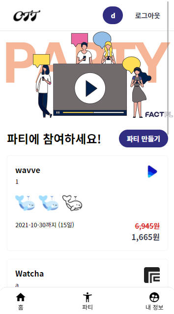

> 1. 파티 목록 페이지에 중간 우측에 있는 "파티 만들기" 버튼 클릭

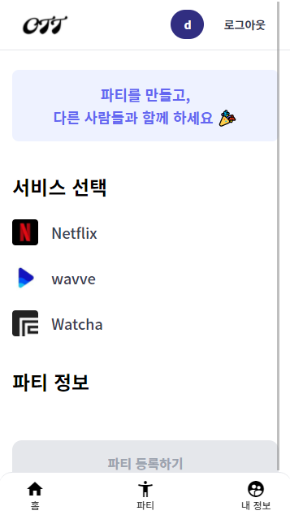

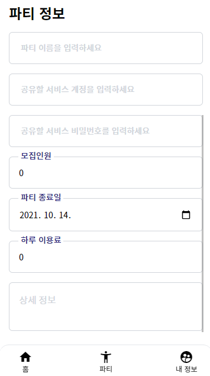

> 1. 공유할 아이디의 제공자를 선택합니다.
> 2. 파티 정보를 입력합니다.
> 3. 파티 등록하기를 눌러, 파티를 등록합니다.

### 파티 참여하기

> 1. 파티 목록에 있는 파티 중 참여하고 싶은 파티를 선택합니다.

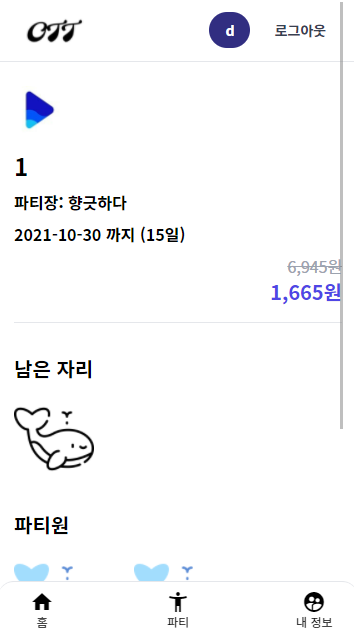

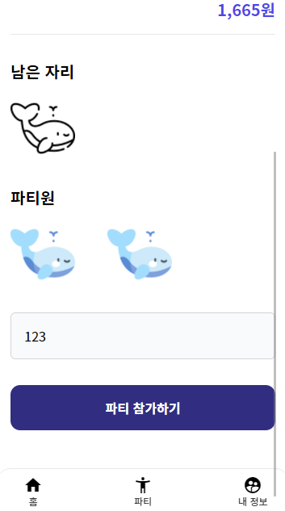

> 1. 파티 이용일수 및 가격을 확인합니다.
> 2. 남은 자리가 있는 지 확인합니다.
> 3. 페이지 하단에 있는 파티 참가하기 버튼을 클릭합니다.

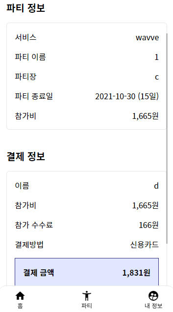

> 1. 파티 정보와 결제 정보를 다시 한번 더 확인합니다.
> 2. 하단에 있는 결제하기 버튼을 클릭하여 결제합니다.

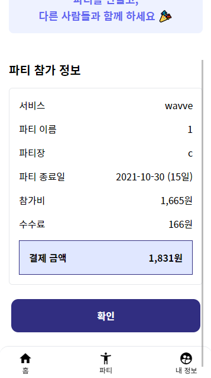

> 1. 참가한 파티에 대한 결제 정보를 확인합니다.
> 2. 내 정보 페이지로 이동합니다.

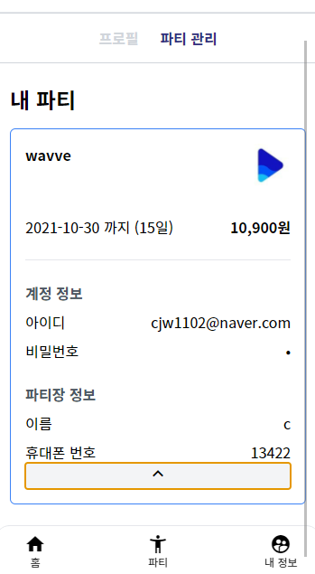

> 프로필 페이지에 있는 파티 관리에서 내 파티를 확인할 수 있습니다.
>
> 공유된 계정 정보를 확인하고, 이를 로그인할 때 사용할 수 있습니다.

