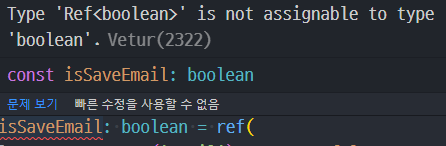
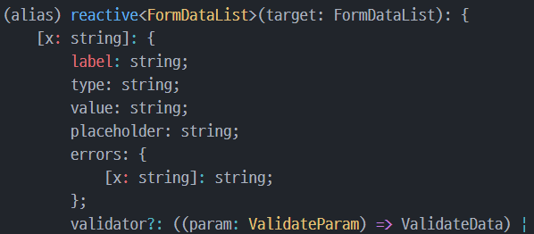
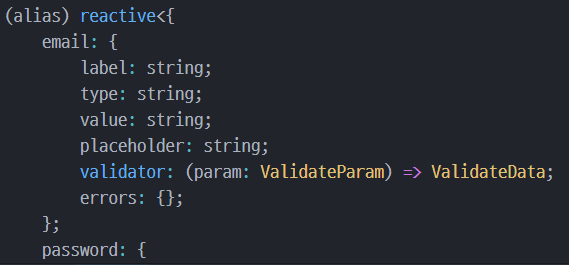

# Typescript interface

## 인터페이스 vs 타입
latest 버전의 tslint에서 어느정도 가이드를 잡아준다.
- Use an interface instead of a type literal.tslint(interface-over-type-literal)
- 그렇다. Type은 리터럴 값에만 사용하고, Object 형태의 타입을 잡아줄 때는 interface를 사용하면 고민없이 행복해진다.

```typescript
export type AType = 'a' | 'b'

export interface InterA {
  name: string
  age: number
}
```

## 인터페이스 컨벤션

UpperCamelCase
- 자세한 내용은 공식 독스 참조

## 인터페이스 모듈화

```typescript
export interface FormDataList {
  [key: string]: FormDataListItem
}

export interface FormDataListItem {
  label: string
  type: string
  value: string
  placeholder: string
  errors: {
    [key: string]: string | undefined
  }
  validator?: (param: ValidateParam) => ValidateData
  message?: string
}

export interface ValidateParam {
  key: string
  value: string
  form: any
}

export interface ValidateData {
  key: string
  type: string
  status: boolean
  message?: string
}
```
위와 같이 모듈을 만들어 둔 뒤 `import { interfaceName }`으로 가져다 쓰면 된다.

## 인터페이스의 요소로 ?를 사용할 때의 주의점

`message?: string` 와 같이 사용할 경우, message는 string 혹은 undefined가 될 수 있다.

이 경우, Object[string] 같은 탐색이 불가능해진다. undefined 형식으로는 하지 못한다는 에러가 발생할 것이다.

따라서 if 문으로 undefined가 아닐 경우에 탐색하도록 락을 걸어줘야 정상적으로 작동한다. 아래는 그 예외처리의 예시를 사용한 함수이다.

```typescript
const handleUpdateValidate = (data: ValidateData) => {
      const { key, type, status, message } = data
      // message와 같이 undefined로 올 수도 있는 경우, 체크를 잘 해주어야 함
      if (!status && message) {
        formData[key].errors[type] = message
      } else {
        delete formData[key].errors[type]
      }
    }
```

## reactive, ref

[ref vs reactive](https://markus.oberlehner.net/blog/vue-3-composition-api-ref-vs-reactive/)

ref와 reactive의 차이에 대해 알아보았는데, `reactive`는 `reactive object`를 선언할 때만 사용하는 것이라는 것을 알았습니다. 그 외의 경우에는 ref를 쓰도록 하겠습니다.

## type assertion 사용의 주의사항
[참조](https://hyunseob.github.io/2017/12/12/typescript-type-inteference-and-type-assertion/)

위의 코드 중 ref의 경우 type assertion을 사용하였고 reactive에서는 reactive<FormDataList>도 물론 작동하지만, 타입 지정자인 `:`로 타입을 선언해도 정상적으로 작동하였습니다.

타입 단언(assertion)은 타입을 변경합니다. 다만 런타임이 아니라 컴파일타임에서만 타입을 변경하기 때문에 `타입 캐스팅`과는 다릅니다.

따라서 컴파일 과정에 생기는 에러를 as, `<>`를 사용한 타입 단언으로 해결할 수 있으나, 너무 많이 사용하는 것은 타입스크립트의 장점을 해친다고 생각했기 때문에 타입 지정 방식인 `:`로 타입을 선언했습니다.

같은 이유로 ref에서는 왜 as 방식으로 해야 하는지 잘 모르겠기 때문에 :로 타입을 지정해 보려 했으나, 그렇게 하니 오류가 났습니다.



오류를 보니, ref를 사용할 경우 return값 자체가 타입 선언문이기 때문인 것으로 보입니다.

### 그런데

`const formData = reactive<FormDataList>` 코드의 reactive 속성



`const formData: FormDataList = reactive` 코드의 reactive 속성



제가 선언한 interface의 자세한 형태가 assertion으로 선언했을 때에 제대로 보이는 것을 확인했습니다.

코드의 통일성을 위한다는 측면에서 ref, reactive는 모두 assertion으로 타입을 바꿔 주겠습니다.
