# Schema


```python
store_columns = (
    "id",  # 음식점 고유번호
    "store_name",  # 음식점 이름
    "branch",  # 음식점 지점 여부
    "area",  # 음식점 위치
    "tel",  # 음식점 번호
    "address",  # 음식점 주소
    "latitude",  # 음식점 위도
    "longitude",  # 음식점 경도
    "category",  # 음식점 카테고리
)

review_columns = (
    "id",  # 리뷰 고유번호
    "store",  # 음식점 고유번호
    "user",  # 유저 고유번호
    "score",  # 평점
    "content",  # 리뷰 내용
    "reg_time",  # 리뷰 등록 시간
)

menu_columns = (
	"id",	# 메뉴 고유번호
    "store", # 음식점 고유번호
    "menu_name", # 메뉴 이름
    "price", # 메뉴 가격
)

user_columns = (
	"id", # 유저 고유번호
    "gender", # 유저 성별
    "age", # 유저 나이
)
```


## 기능/과제


### Req. 1. 데이터 전처리(parse.py)

- menu_frame 구현하기
- user_frame 구현하기

```python
# import_data
def import_data(data_path=DATA_FILE):
    """
    Req. 1-1-1 음식점 데이터 파일을 읽어서 Pandas DataFrame 형태로 저장합니다
    """

    try:
        with open(data_path, encoding="utf-8") as f:
            data = json.loads(f.read())
    except FileNotFoundError as e:
        print(f"`{data_path}` 가 존재하지 않습니다.")
        exit(1)

    stores = []  # 음식점 테이블
    reviews = []  # 리뷰 테이블
    menus = []  # 메뉴 테이블
    users = []  # 유저 테이블
    users_id_list = []  # 중복 유저 방지용 테이블

    for d in data:
        categories = [c["category"] for c in d["category_list"]]
        # 음식점 분류 값을 추출하여, 필요하지 않은 키를 제외한 값만 추출
        stores.append(
            [
                d["id"],
                d["name"],
                d["branch"],
                d["area"],
                d["tel"],
                d["address"],
                d["latitude"],
                d["longitude"],
                "|".join(categories),  # 텍스트 형태로 저장 (왜?)
            ]
        )
        # store_columns의 순서에 맞도록 값을 넣는다.

        # 메뉴 데이터 추출
        for menu in d["menu_list"]:
            menus.append(
                [
                    len(menus) + 1,  # 메뉴는 id가 따로 부여되어있지 않아서, 임의로 부여함
                    d["id"],
                    menu["menu"],
                    menu["price"],
                ]
            )

        # 리뷰 및 유저 데이터 추출
        for review in d["review_list"]:
            r = review["review_info"]
            u = review["writer_info"]

            reviews.append(
                [r["id"], d["id"], u["id"], r["score"], r["content"], r["reg_time"]],
            )

            if u["id"] not in users_id_list:
                users.append(
                    [
                        u["id"],
                        u["gender"],
                        datetime.now().year - int(u["born_year"]) + 1,
                    ]
                )
                users_id_list.append(u["id"])

    store_frame = pd.DataFrame(data=stores, columns=store_columns)
    review_frame = pd.DataFrame(data=reviews, columns=review_columns)
    menu_frame = pd.DataFrame(data=menus, columns=menu_columns)
    user_frame = pd.DataFrame(data=users, columns=user_columns)

    return {
        "stores": store_frame,
        "reviews": review_frame,
        "menus": menu_frame,
        "users": user_frame,
    }
```


### Req 2. 데이터 통계 값 구하기 (analyze.py)

#### Req 2-1. 음식점 평점 순 출력하기

```python
def sort_stores_by_score(dataframes, n=20, min_reviews=30):
    """
    Req. 1-2-1 각 음식점의 평균 평점을 계산하여 높은 평점의 음식점 순으로 `n`개의 음식점을 정렬하여 리턴합니다
    Req. 1-2-2 리뷰 개수가 `min_reviews` 미만인 음식점은 제외합니다.
    """
    # dataframes["stores"]["id"] == dataframes["reviews"]["store"]
    stores_reviews = pd.merge(
        dataframes["stores"], dataframes["reviews"], left_on="id", right_on="store"
    )
    scores_group = stores_reviews.groupby(["store", "store_name"])
    scores = scores_group.mean()
    # Todo: 평균 평점을 기준으로 음식점 정렬
    scores = scores.sort_values(by="score", ascending=False)
    return scores.head(n=n).reset_index()
```


#### Req 2-2. 최소 리뷰 개수 필터링

[참고 블로그](https://steadiness-193.tistory.com/37)

`pandas.DataFrame.groupby` 를 할 때, 리뷰의 개수를 확인하려면 어떻게 해야 할까?

```python
# store 데이터 프레임과, reviews 데이터 프레임을 병합
stores_reviews = pd.merge(
	df["stores"], df["reviews"], left_on="id", right_on="store",
)

# 특정 컬럼을 기준으로 그룹화
scores_group = stores_reviews.groupby(["store", "store_name"])
print(type(scores_group))
# pandas.core.groupby.generic.DataFrameGroupBy

# 그룹화된 후에 각각 그룹의 길이는 곧 리뷰의 개수를 나타낸다.
# 리뷰의 개수를 기준으로 필터링하여 값을 업데이트한다.
stores_group = stores_group.filter(lambda x: len(x) >= min_reviews).groupby(
    ["store", "store_name"]
)
# filter를 하니 groupby가 풀려버려, groupby를 이용해 다시 묶어주었다.

# 모든 필드에 대해 평균값을 계산하였다.
scores = stores_group.mean()
```


#### Req 2-3. 리뷰 개수 기준 음식점 정렬

- 가게와 리뷰를 합친다. `merge`
- 가게를 기준으로 그룹화한다. `groupby`
- 그룹별로 개수를 세고, 그 수를 기준으로 정렬한다. (?)


```python
def get_most_reviewed_stores(dataframes, n=20):
    """
    Req. 1-2-3 가장 많은 리뷰를 받은 `n`개의 음식점을 정렬하여 리턴합니다
    """
    # review 순으로 store를 정렬하기 위해
    # store와 review 데이터 프레임을 병합한다.
    stores_reviews = pd.merge(
        dataframes["stores"], dataframes["reviews"], left_on="id", right_on="store"
    )
    # 모든 컬럼을 다 확인하려고, 모든 컬럼을 넣음
    scores_group = stores_reviews.groupby(
        [
            "store",
            "store_name",
            "branch",
            "area",
            "tel",
            "address",
            "latitude",
            "longitude",
            "category",
        ]
    )
    # 리뷰 순으로 정렬
    scores_group_sorted_by_rc = (
        scores_group.store.count()
        .reset_index(name="review_count")
        .sort_values(["review_count"], ascending=False)
    )
    # 상위 n개의 음식점을 반환
    return scores_group_sorted_by_rc.head(n=n).reset_index()
```

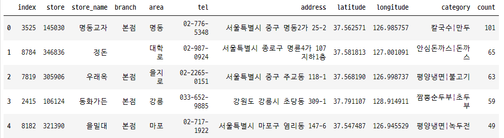


#### Req 2-4. 리뷰 개수 기준 이용자 정렬

- 이용자와 리뷰 데이터를 합칩니다: `merge`
- 리뷰 컬럼을 기준으로 그룹화합니다: `groupby`
- 리뷰 개수를 기준으로 정렬합니다: `sort_values`

```python
def get_most_active_users(dataframes, n=20):
    """
    Req. 1-2-4 가장 많은 리뷰를 작성한 `n`명의 유저를 정렬하여 리턴합니다.
    """
    users_reviews = pd.merge(
        dataframes["users"], dataframes["reviews"], left_on="id", right_on="user"
    )
    users_reviews_grouped = (
        users_reviews.groupby(["user", "gender", "age"])
        .user.count()
        .reset_index(name="review_count")
    )
    users_reviews_sorted = users_reviews_grouped.sort_values(
        ["review_count"], ascending=False
    )
    return users_reviews_sorted.head(n=n).reset_index()
```


### Req 3. 시각화

#### 1. 전체 음식점의 리뷰 개수 분포

```python
def show_store_review_distribution_graph(dataframes):
    """
    Req. 1-3-1 전체 음식점의 리뷰 개수 분포를 그래프로 나타냅니다.
    """
    stores = dataframes["stores"]
    r = stores.groupby("review_cnt")["review_cnt"].count().reset_index(name="count")
    r = r[r["review_cnt"] > 0]
    chart = sns.barplot(data=r, x="review_cnt", y="count")
    chart.set(yscale="log")
    plt.title("전체 음식점의 리뷰 개수 분포")
    plt.show()
```

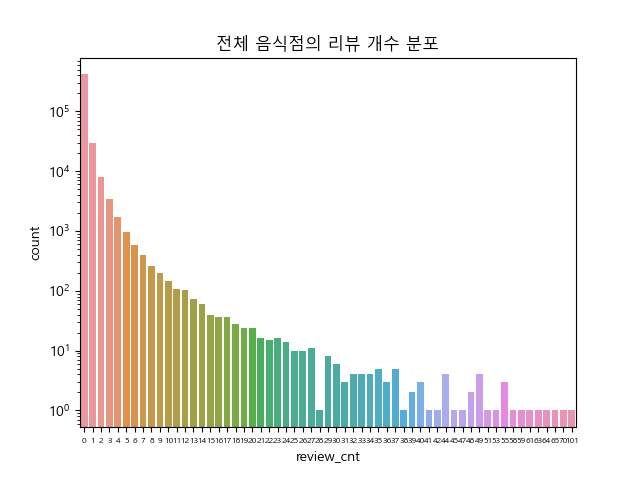

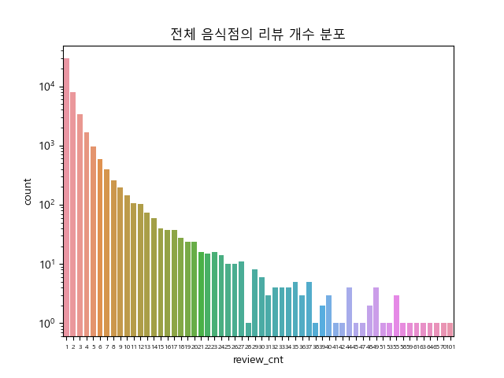

#### 2. 음식점의 평균 평점

```python
def show_store_average_ratings_graph(dataframes):
    """
    Req. 1-3-2 각 음식점의 평균 평점을 그래프로 나타냅니다.
    """
    stores_reviews = pd.merge(
        dataframes["stores"], dataframes["reviews"], left_on="id", right_on="store"
    )
    # stores Dataframe과 reviews Dataframe을 병합

    store_mean_score = (
        stores_reviews.groupby("store")["score"].mean().reset_index(name="mean_score")
    )
    # 평균 평점을 구하기 위해 score에 mean 메서드를 실행

    store_mean_score["mean_score"] = store_mean_score["mean_score"].round(decimals=1)
    # 평균 평점이 너무 파편화되어있어, 소수점 첫째자리를 기준으로 반올림하였음

    mean_score_count = (
        store_mean_score.groupby("mean_score").size().reset_index(name="count")
    )
    # 평균 평점 Column을 기준으로 그룹화
    # 같은 평균 평점을 갖고 있는 가게의 수를 세고, count라는 컬럼을 생성하여 저장

    chart = sns.scatterplot(x="mean_score", y="count", data=mean_score_count)
    chart.set(yscale="log")
    plt.title("각 음식점의 평균 평점")
    plt.show()
```

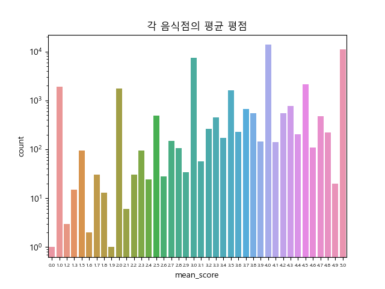

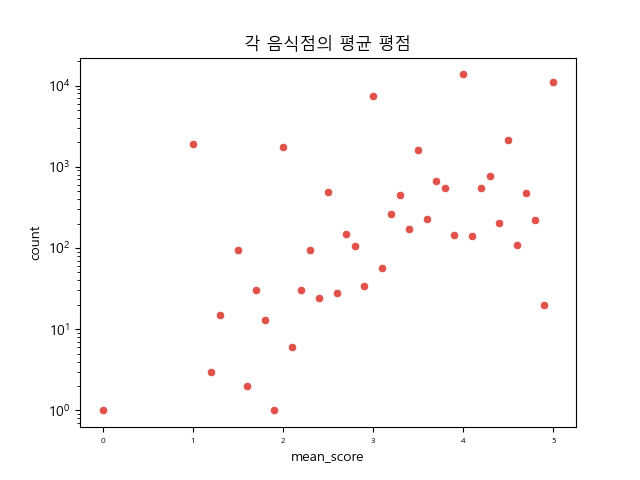

#### 3. 전체 유저의 리뷰 개수 분포

```python
def show_user_review_distribution_graph(dataframes):
    """
    Req. 1-3-3 전체 유저의 리뷰 개수 분포를 그래프로 나타냅니다.
    """
    users_reviews = pd.merge(
        dataframes["users"], dataframes["reviews"], left_on="id", right_on="user"
    )
    # users dataframe과 reviews dataframe을 병합

    users_review_cnt = (
        users_reviews.groupby(["user"]).size().reset_index(name="review_cnt")
    )
    # user column을 기준으로 그룹화
    # 동일한 유저 내에서

    grouped = users_review_cnt.groupby(["review_cnt"]).size().reset_index(name="count")
    chart = sns.scatterplot(data=grouped, x="review_cnt", y="count")
    chart.set(yscale="log")
    plt.title("전체 유저의 리뷰 개수")
    plt.show()
```

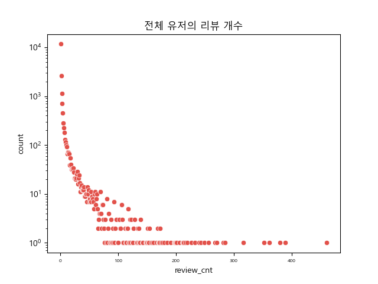

#### 4. 전체 유저의 성별/나이대 분포

```python
def show_user_age_gender_distribution_graph(dataframes):
    """
    Req. 1-3-4 전체 유저의 성별/나이대 분포를 그래프로 나타냅니다.
    """
    users = dataframes["users"]
    users = users[(0 < users["age"]) & (users["age"] < 100)]
    # 음수와 100살 기준으로 나이 필터링

    chart = sns.countplot(data=users, x="age", hue="gender")
    sns.move_legend(chart, "upper right")
    plt.title("전체 유저의 성별/나이대 분포")
    plt.xticks(rotation="vertical")
    plt.show()
```

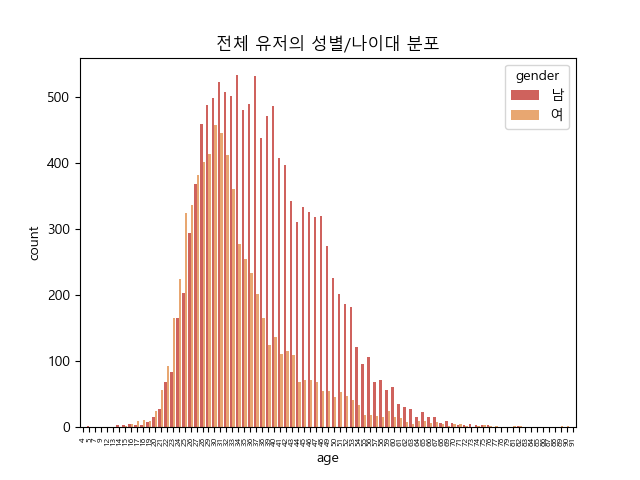

##### 20-30 기준

```python
def show_user_age_gender_distribution_graph(dataframes):
    """
    Req. 1-3-4 전체 유저의 성별/나이대 분포를 그래프로 나타냅니다.
    """
    users = dataframes["users"]
    # users = users[(0 < users["age"]) & (users["age"] < 100)]
    # 음수와 100살 기준으로 나이 필터링
    users = users[(19 < users["age"]) & (users["age"] < 40)]
    # 20 / 30대

    chart = sns.countplot(data=users, x="age", hue="gender")
    sns.move_legend(chart, "upper left")
    plt.title("전체 유저의 성별/나이대 분포")
    plt.xticks(fontsize=10, rotation="vertical")
    plt.show()
```

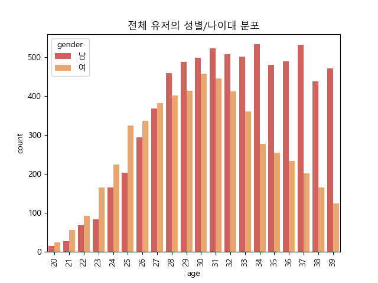


#### 5. 음식점 위치 분포

1. latitude, longitude에 값이 담겨있지 않은 경우 필터링

   latitude와 longitude는 str 타입이기에 부등호로 비교가 불가능함

   latitude와 longitude를 형변환 한 뒤에 필터링함

   ```python
   stores = dataframes["stores"]
   stores = stores.astype({"latitude": float, "longitude": float})
   stores = stores[(stores["latitude"] > 0) & (stores["longitude"] > 0)]
   ```

##### 평점 4점 이상, 리뷰 개수 10개 이상

```python
stores_reviews = pd.merge(
    dataframes["stores"],
    dataframes["reviews"],
    left_on="id",
    right_on="store"
)
stores = stores_reviews.groupby(["store", "store_name", "latitude", "longitude", "review_cnt"])["score"].mean().reset_index(name="mean_score")
stores = stores.astype({"latitude": float, "longitude": float})
stores["mean_score"] = stores["mean_score"].round(decimals=1)
stores = stores[
    (stores["latitude"] > 0)
    & (stores["longitude"] > 0)
]
stores = stores[
    (stores["review_cnt"] >= 10)
    & (stores["mean_score"] >= 4)
].reset_index().drop(columns=["index"], axis=1)
```


##### Map 렌더링

```python
import folium
lat = stores["latitude"].mean()
long = stores["longitude"].mean()

m = folium.Map([lat, long], zoom_start=8)
for i in stores.index:
    s_lat = stores.loc[i, "latitude"]
    s_long = stores.loc[i, "longitude"]
    s_name = stores.loc[i, "store_name"]
    folium.Marker([s_lat, s_long], tooltip=s_name).add_to(m)
```

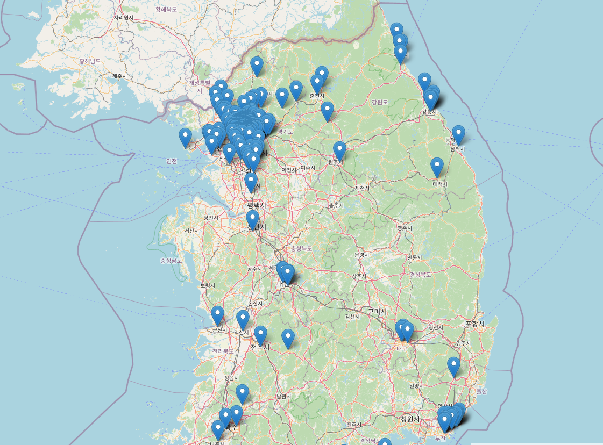


### Req 4. 유저-아이템 행렬 생성

#### Req 4-1. 유저 - 음식점 행렬 생성

##### 사전작업

1. 한 음식점에 중복으로 평가를 매긴 사람이 있을까?

   ```python
   reviews = data["reviews"]
   reviews[reviews.duplicated(["user", "store"])].count()
   # id          0
   # store       0
   # user        0
   # score       0
   # content     0
   # reg_time    0
   # dtype: int64
   ```

   

##### 1. pivot_table()

- DataFrame.pivot_table()

```python
users_reviews = pd.merge(
	data["users"],
    data["reviews"],
    left_on="id",
    right_on="user"
)
# 

ur_pivot_table = users_reviews.pivot_table(index="user", columns="store", values="score", aggfunc=np.mean)
ur_pivot_sparsetype = ur_pivot_table.astype(pd.SparseDtype("int", np.nan))
```

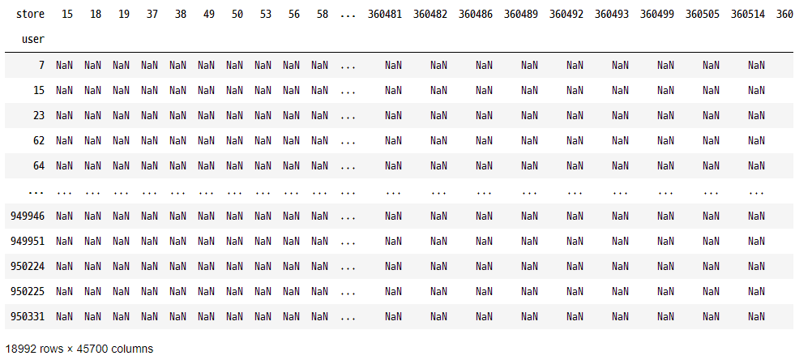


##### 2. 배열 생성 후 값 추가 (Error)

```python
user_list = list(data["users"].sort_values("id")["id"])
store_list = list(data["stores"].sort_values("id")["id"])

pd.DataFrame(data=np.nan, index=user_list, columns=store_list)
# MemoryError: Unable to allocate 65.1 GiB for an array with shape (18992, 459988) and data type float64
```


#### Req 4-2. 유저 - 카테고리 행렬 생성

- Series.str.split()
- DaraFrame.explode()
- https://emilkwak.github.io/pandas-dataframe-settingwithcopywarning

```python
stores = data["stores"].copy()[["id", "category"]]
# 셀 안에 있는 정보를 바꿀 예정(split)이기 때문에, copy 메서드를 이용하여 메모리 단에서 분리한다.
# 필요한 컬럼만 남긴다 (id, category)

stores = stores[(stores["category"] != "") & (stores["review_cnt"] > 0)]
# category가 없거나, review가 달리지 않은 음식점은 제거한다.

stores["category"] = stores["category"].str.split("|")
# 구분자("|")로 구분되어 있던 category를 리스트 형태로 변환한다.

stores = stores.explode("category")
# 리스트 형태인 category를 기준으로 row를 분리한다.

reviews = data["reviews"][["store", "user", "score"]]
# 필요한 컬럼만 남긴다("store", "user", "score")

stores_reviews = pd.merge(stores, reviews, left_on="id", right_on="store")
# store와 review 데이터 프레임을 합친다.

grouped = stores_reviews.groupby(["user", "category"])["score"].mean().reset_index(name="score")
# user_id와 category를 기준으로 그룹화한다.
# score 컬럼의 평균을 score에 저장한다.

uc_pivot_table = grouped.pivot_table(index="user", columns="category", values="score")
# pivot_table로 2개의 축을 갖는 행렬로 만든다.

uc_pivot_sparsetype = uc_pivot_table.astype(pd.SparseDtype("float", np.nan))
# 내부 데이터의 타입을 변환시킨다.
```

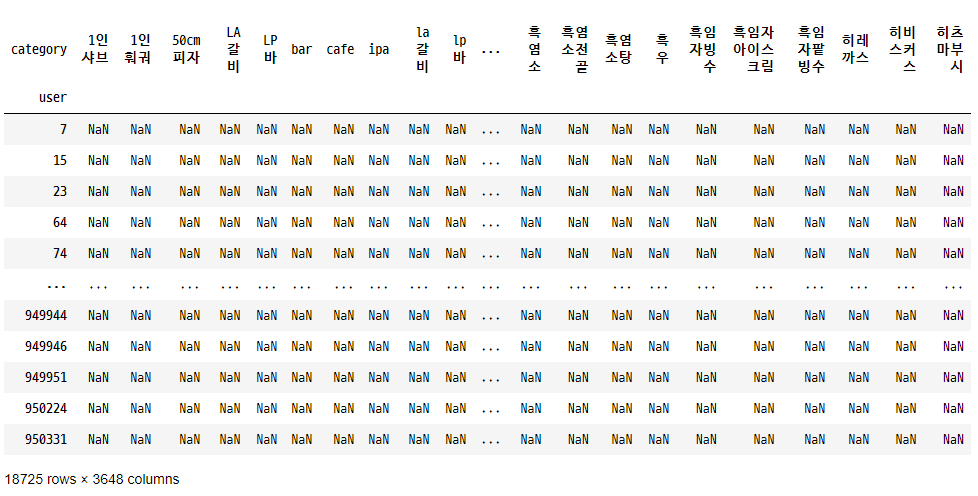


## 참고

### pandas

#### pandas.merge

Merge DataFrame or named Series objects with a database-style join.

##### parameters

- left: DataFrame
- right: DataFrame
- left_on: Column or index level names to join on in the left DataFrame.
- right_on: Column or index level names to join on in the right DataFrame.

**store의 id와 review의 store가 외래키로 연결되어있다.**

```python
stores_reviews = pd.merge(
    data["stores"], data["reviews"], left_on="id", right_on="store"
)
```


#### pandas.DataFrame.groupby

Group DataFrame using a mapper or by a Series of columns.

```python
stores_group = stores_reviews.groupby(["store", "store_name"])
```


#### pandas.DataFrame.sort_values

Sort by the values along either axis.

```python
>>> df = pd.DataFrame({
    'col1': ['A', 'A', 'B', np.nan, 'D', 'C'],
    'col2': [2, 1, 9, 8, 7, 4],
    'col3': [0, 1, 9, 4, 2, 3],
    'col4': ['a', 'B', 'c', 'D', 'e', 'F']
})
>>> df
  col1  col2  col3 col4
0    A     2     0    a
1    A     1     1    B
2    B     9     9    c
3  NaN     8     4    D
4    D     7     2    e
5    C     4     3    F
```

```python
>>> df.sort_values(by=['col1'])
  col1  col2  col3 col4
0    A     2     0    a
1    A     1     1    B
2    B     9     9    c
5    C     4     3    F
4    D     7     2    e
3  NaN     8     4    D
```

```python
# Sort by multiple columns
>>> df.sort_values(by=['col1', 'col2'])
  col1  col2  col3 col4
1    A     1     1    B
0    A     2     0    a
2    B     9     9    c
5    C     4     3    F
4    D     7     2    e
3  NaN     8     4    D
```


#### pandas.DataFrame.reset_index()

Reset the index, for a level of it.


#### pandas.DataFrame.mask

Replace values where the condition is True


#### 문자형 칼럼을 숫자형으로 바꾸기

- pandas.to_numeric

  ```python
  s = pd.Series(['1.0', '2', -3])
  pd.to_numeric(s)
  0    1.0
  1    2.0
  2   -3.0
  dtype: float64
  pd.to_numeric(s, downcast='float')
  0    1.0
  1    2.0
  2   -3.0
  dtype: float32
  pd.to_numeric(s, downcast='signed')
  0    1
  1    2
  2   -3
  dtype: int8
  s = pd.Series(['apple', '1.0', '2', -3])
  pd.to_numeric(s, errors='ignore')
  0    apple
  1      1.0
  2        2
  3       -3
  dtype: object
  pd.to_numeric(s, errors='coerce')
  0    NaN
  1    1.0
  2    2.0
  3   -3.0
  dtype: float64
  ```

- DataFrame.astype()

  ```python
  d = {'col1': [1, 2], 'col2': [3, 4]}
  df = pd.DataFrame(data=d)
  df.dtypes
  col1    int64
  col2    int64
  dtype: object
      
  df.astype({'col1': 'int32'}).dtypes
  col1    int32
  col2    int64
  dtype: object
  ```

  


### Groupby => DataFrame

```
만약 특정 변수에 대해서만 그룹별 요약/집계를 하고 싶다면 해당 변수를 indexing해주면 되며, 한개 변수에 대해서만 GroupBy 집계를 하면 반환되는 결과는 Series가 됩니다. 한개 변수에 대해 GroupBy 집계해서 나온 Series를 데이터프레임으로 만들고 싶으면 pd.DataFrame() 를 사용해서 집계 결과를 데이터프레임으로 변환해주면 됩니다. 

출처: https://rfriend.tistory.com/391 [R, Python 분석과 프로그래밍의 친구 (by R Friend)]
```


### 


