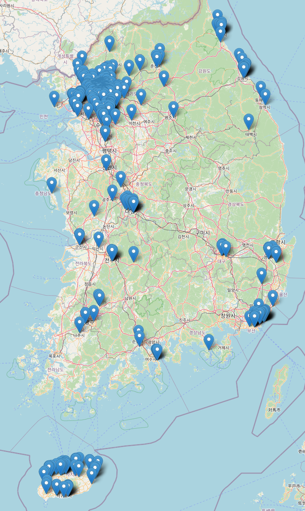
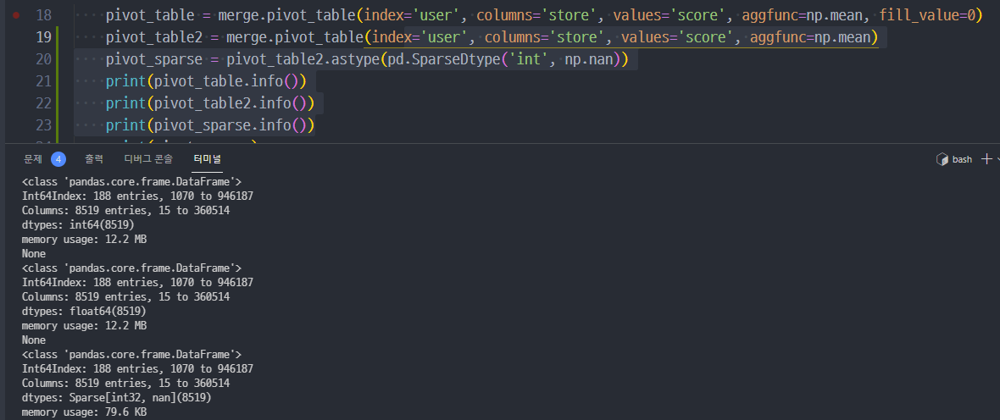

# Sub Project - 1

[TOC]

- pandas
- matplotlib
- seaborn
- folium

데이터 처리 관련 기술을 경험해 보는 서브 프로젝트

## 과제 파일

- parse.py
- analaze.py
- visualize.py
- map.html: 3-5, 지도에 음식점 분포 찍기
- sparse.py: 4-1, 4-2 Sparse matrix 만들기 (Compressed sparse row format)

## 3-5. 음식점의 위치 분포를 지도에 나타내기

- folium 라이브러리를 사용합니다.
- GeoJson format으로 point를 Map 객체에 추가합니다.

```
{
  "type": "Feature",
  "geometry": {
    "type": "Point",
    "coordinates": [125.6, 10.1]
  },
  "properties": {
    "name": "Dinagat Islands"
  }
}
```

### df_to_geojson

- DataFrame 데이터를 geojson 포맷에 맞도록 변경하는 함수

```python
def df_to_geojson(df):
    geojson = {'type': 'FeatureCollection', 'features': []}

    for _, row in df.iterrows():
        feature = {
            "type": "Feature",
            "geometry": {
                "type": "Point",
                "coordinates": []},
            "properties": {}
        }
        feature['geometry']['coordinates'] = [row['longitude'], row['latitude']]
        feature['properties']['tel'] = row['tel']
        feature['properties']['address'] = row['address']
        feature['properties']['area'] = row['area']

        geojson['features'].append(feature)
    return geojson
```

### show_stores_distribution_graph

- 진행 과정에 따라 조금씩 달라질 예정입니다.

```python
def show_stores_distribution_graph(dataframes):
    """
    Req. 1-3-5 각 음식점의 위치 분포를 지도에 나타냅니다.
    """
    df = dataframes["stores"]
    # 리뷰가 10개 이상 달린
    df = df[df['review_cnt'] > 10]
    m = folium.Map(
        location=[35.8, 127.6], tiles="OpenStreetMap", zoom_start=8
    )
    geo_json = df_to_geojson(df)
    folium.GeoJson(geo_json, name="geojson").add_to(m)

    # 스크롤 기능
    plugins.MousePosition().add_to(m)
    # 전체화면 기능
    plugins.Fullscreen(
        position='topright',
        title='확장하기',
        title_cancel='나가기',
        force_separate_button=True
    ).add_to(m)

    m.save('map.html')
```

### 진행과정

- 단순하게 point만 찍은 Map

```python
# 리뷰가 10개 이상 달린
    df = df[df['review_cnt'] > 10]
```



## 4-1 유저와 음식점을 축으로 하고 평점을 값으로 갖는 행렬 저장

- Sparse
- 희소 행렬보다 더 메모리 효율이 좋은 CSR Matrix로 저장

`scipy.sparse.csr_matrix()` 를 써서 df를 Compressed Sparse Numpy Matrix로 바꾸는 작업

- 데이터 재구조화 (reshaping)
- data.pivot(index, columns, values)
- pd.pivot_table(data, index, columns, values, aggfunc)

기존의 데이터를 sparse matrix 에서 Compressed sparce array로 바꿔주기

### pivot_table의 NaN, 결측값 제거

```python
pivot_table = merge.pivot_table(index='user', columns='store', values='score', aggfunc=np.mean, fill_value=0)
print(pivot_table)

pivot_table2 = merge.pivot_table(index='user', columns='store', values='score', aggfunc=np.mean)
print(pivot_table2)

pitov_sparse = pivot_table2.astype(pd.SparseDtype('int', np.nan))
print(pitov_sparse)
```

fill_value=0 또는 fillna(0)의 경우에만 제대로 결측값 변경에 성공한다.

### sparse dtype으로의 변환



sparse dtype으로 변경했을 때, 드라마틱한 메모리 용량의 변화가 있음을 볼 수 있다.

sparse 타입으로 pivot_table을 변경하고, 이후 csr_matrix로 변환해 주었다.

https://rfriend.tistory.com/551

## 4-2 유저와 음식점 카테고리를 축으로 하고 평점 평균을 값으로 갖는 행렬

```python
def users_stores_csr_matrix(dataframes):
    stores = dataframes["stores"][['id', 'category', 'review_cnt']]
    # 카테고리가 없거나 리뷰가 없는 가게는 제거
    stores = stores[(stores['category'] != "") & (stores['review_cnt'] > 0)]
    stores['category'] = stores['category'].str.split('|')

    # category를 explode로 해서 열을 폭발시켜 줘야 한다
    stores = stores.explode('category')

    # TypeError: unhashable type: 'list'
    reviews = dataframes["reviews"][['store', 'user', 'score']]

    merge = pd.merge(
        stores, reviews, left_on='id', right_on='store'
    )
    # user id, category, avg_score를 컬럼으로 하는 새로운 df 생성
    gp = merge.groupby(['user', 'category'])['score'].mean().reset_index(name='avg_score')

    # pivot table 생성
    pivot_table = gp.pivot_table(index='user', columns='category', values='avg_score')

    # sparse dtype으로 변경
    pivot_sparse = pivot_table.astype(pd.SparseDtype('float'))

    # Compressed sparsed row Matrix로 변환하여 리턴
    csr_matrix = scipy.sparse.csr_matrix(pivot_sparse)
    return csr_matrix
```


https://stackoverflow.com/questions/58301019/split-row-in-pandas-into-multiple-rows-based-on-the-symbol
